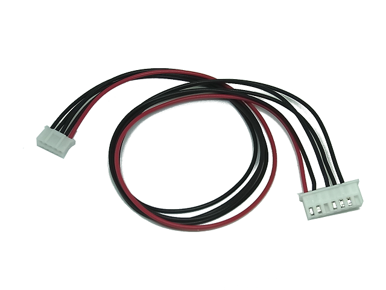

Programming Cable
=========

  
The Programming Cable is the hardware connection for programming and communication with [Uart WiFi Board](https://github.com/NaoNaoMe/Uart-WiFi-Board). 

Wiring diagram
| PH Connector  | XH Connector  |
| ------------- | ------------- |
| 1             | 1             |
| 2             | 4             |
| 3             | 2             |
| 4             | 5             |
| 5             | 6             |

License
-------------------
The repository is released under [Creative Commons ShareAlike 4.0 International](https://creativecommons.org/licenses/by-sa/4.0/).

Distributed as-is; no warranty is given.
