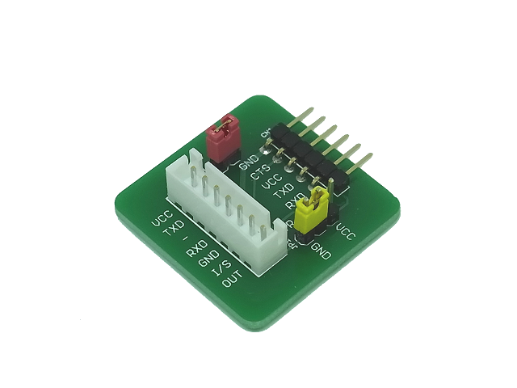
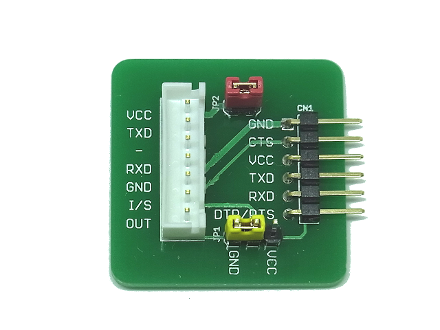

FTDI Breakout Adapter
=========

  
The FTDI Breakout Adapter convert interface from the FTDI Basic Breakout board pin-out to XH connector.
It is used for flashing software in [Uart WiFi Board](https://github.com/NaoNaoMe/Uart-WiFi-Board).

Repository Contents
-------------------
* **/Hardware** - All Eagle design files (.brd, .sch)
* **/Cables** - Cables info

Description(Pin Interfaces)
-------------------

### CN1 Pin Descriptions:
This headers are for an FTDI port.

### CN2 Pin Descriptions:
This connector is for your target board.

| Pin | Name | Description                                       |
| --- | ---- | ------------------------------------------------- |
| 1   | VCC  | VCC-CN1 with a jumper (Short or Open)             |
| 2   | TX   | TXD-CN1                                           |
| 3   | -    | No connection.                                    |
| 4   | RX   | RXD-CN1                                           |
| 5   | GND  | GND-CN1                                           |
| 6   | I/S  | CTS-CN1 with a jumper (High, Low or No-connect)   |
| 7   | OUT  | DTR/RTS-CN1                                       |

### Jumpers:
 - **JP1:** This jumper changes the voltage level on CN2-I/S pin.
 - **JP2:** This jumper allows you to supply voltage from FTDI port.

License
-------------------
The repository is released under [Creative Commons ShareAlike 4.0 International](https://creativecommons.org/licenses/by-sa/4.0/).

Distributed as-is; no warranty is given.
